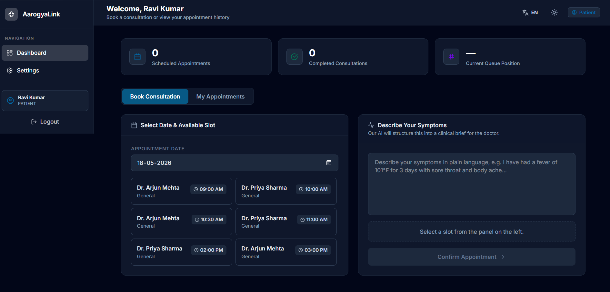
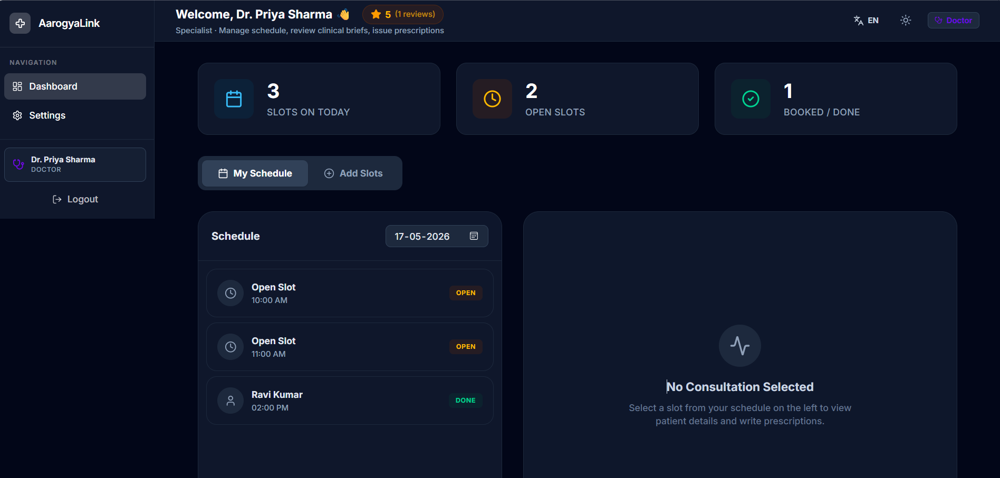
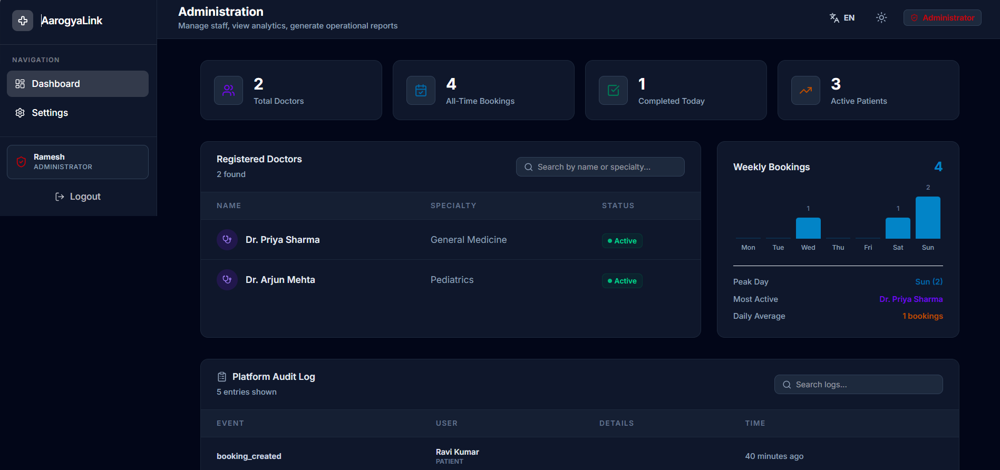

# 🏥 AarogyaLink — Rural Telemedicine Platform

> **Project No. 11 · Health & Emergency · MERN Stack BTech**
> **Group 7** · Team Lead: Suhani Agarwal · Members: Gursneh Kaur, Aryaman Bohra, Nidhesh Soni

AarogyaLink is a comprehensive, bilingual (English/Hindi) telemedicine platform built specifically to bridge the healthcare gap in rural India. It connects rural patients and ASHA workers with specialized urban doctors through seamless video consultations, AI-powered symptom triage, and real-time smart queuing.

---

## 📸 Platform Showcase

### Patient Dashboard


### Doctor Dashboard


### Admin Dashboard


---

## ✨ Key Features

- **🌐 Bilingual UI (i18n):** Full Hindi & English support across all dashboards for rural accessibility.
- **🤖 AI Symptom Triage:** Integrates Claude AI to parse raw patient symptoms into structured, professional clinical briefs for doctors before the consultation begins.
- **⚡ Real-time Smart Queue:** Uses Server-Sent Events (SSE) to broadcast live queue position updates to waiting patients so they know exactly when it is their turn.
- **🎥 Integrated Video Calls:** Seamless telemedicine video consultations.
- **📄 Background PDF Generation:** Uses BullMQ and native Node.js Worker Threads (`worker_threads`) to generate downloadable PDF prescriptions without blocking the main event loop.
- **🔒 Role-Based Access Control (RBAC):** Secure 4-tier architecture isolating functionality for Patients, Doctors, ASHA Workers, and Admins.
- **📈 High Performance Caching:** A Redis cache-aside layer ensures lightning-fast slot loading and protects the MongoDB database from heavy read traffic.

---

## 🛠️ Tech Stack

**Frontend (Client)**
- **Framework:** React 18 (Vite)
- **Styling:** Tailwind CSS, Framer Motion (Animations)
- **Routing & State:** React Router DOM, React Context API
- **Localization:** i18next, react-i18next

**Backend (API Server)**
- **Runtime:** Node.js, Express.js
- **Architecture:** MVC (Model-View-Controller)
- **Auth:** JWT (Short-lived Access + HTTP-Only Refresh Tokens)
- **Concurrency:** Server-Sent Events (SSE), Worker Threads

**Database & Infrastructure**
- **Primary DB:** MongoDB (Mongoose)
- **Cache & Message Broker:** Redis (ioredis)
- **Job Queue:** BullMQ
- **Containerization:** Docker & Docker Compose

---

## 🚀 Quick Start (One Command)

```bash
# 1. Clone the repo
git clone https://github.com/Suhaniagarwal5/aarogyalink-telemedicine.git
cd aarogyalink-telemedicine

# 2. Start MongoDB + Redis via Docker
docker compose up -d mongo redis

# 3. Install & seed backend
cd backend
npm install
npm run seed        # creates test users + 42 slots (7 days × 6 slots/day)
npm run dev         # starts backend on http://localhost:5005

# 4. Install & start frontend (new terminal)
cd ../frontend
npm install
npm run dev         # starts frontend on http://localhost:5173
```

Open `http://localhost:5173` — done.

---

## 🐳 Full Stack via Docker Compose (all 4 services)

```bash
docker compose up --build
```

| Service | URL |
|---|---|
| Frontend | http://localhost:5173 |
| Backend API | http://localhost:5005 |
| MongoDB | localhost:27017 |
| Redis | localhost:6379 |

---

## 🔑 Environment Variables

Copy `.env.example` to `backend/.env` and fill in:

```env
# Server
NODE_ENV=development
PORT=5005
UV_THREADPOOL_SIZE=16

# Database
MONGO_URI=mongodb://localhost:27017/aarogyalink   # or your Atlas URI

# Cache
REDIS_URL=redis://localhost:6379

# Auth
JWT_SECRET=your_jwt_secret_here
JWT_REFRESH_SECRET=your_refresh_secret_here

# AI (Anthropic Claude)
ANTHROPIC_API_KEY=sk-ant-...your-key...
CLAUDE_API_KEY=sk-ant-...same-key...

# Email (Gmail App Password)
EMAIL_USER=your@gmail.com
EMAIL_PASS=your-app-password-16chars
```

Frontend `.env` (optional — defaults to localhost:5005):
```env
VITE_API_BASE_URL=http://localhost:5005/api
```

---

## 🧪 Test Accounts (after `npm run seed`)

| Role | Email | Password |
|---|---|---|
| Patient | ravi@patient.com | password123 |
| Patient | meena@patient.com | password123 |
| Patient | gopal@patient.com | password123 |
| Doctor | priya@doctor.com | password123 |
| Doctor | arjun@doctor.com | password123 |
| ASHA Worker | sunita@asha.com | password123 |
| Admin | admin@hospital.com | password123 |

---

## 🧱 Architecture Overview

```
Browser (React)
    │
    ├─ Axios + JWT interceptor (silent refresh on 401)
    │
    ▼
Express API (Node.js — port 5005)
    │
    ├── Auth middleware (JWT verify) → RBAC middleware (role check)
    │
    ├── /api/slots       → Redis cache-aside → MongoDB Slot collection
    ├── /api/bookings    → Atomic findOneAndUpdate → Redis sorted queue
    │                     → Claude AI triage → SSE broadcast → BullMQ job
    ├── /api/auth        → JWT access (15min) + refresh (7d httpOnly cookie)
    ├── /api/admin       → MongoDB aggregation pipeline
    └── /api/sse         → Server-Sent Events (long-lived HTTP stream)
         │
         ├── Redis (ioredis) — slot cache + appointment queue sorted sets
         ├── MongoDB (mongoose) — all persistent data + compound indexes
         ├── BullMQ job queue → pdf.worker.js → pdf.thread.js (worker_thread)
         └── Nodemailer → Gmail SMTP (confirmation + reminder emails)
```

---

## 🎓 Teacher Checklist — Concept Map

| Concept | File / Location |
|---|---|
| **Race condition fix** | `booking.controller.js` → `findOneAndUpdate({isBooked:false})` |
| **Redis cache-aside + TTL** | `slot.routes.js` → `client.get/set` with `EX:300` |
| **Redis sorted set (queue)** | `booking.controller.js` → `client.zAdd/zRange/zRem` |
| **JWT + refresh token** | `auth.routes.js`, `middleware/auth.js` |
| **4-role RBAC** | `middleware/rbac.js` → `checkRole([...])` |
| **Axios silent refresh** | `frontend/src/api/axiosInstance.js` |
| **useMemo / useCallback** | Heavily utilized across all React Dashboards for performance optimization |
| **SSE (server-sent events)** | `sse.routes.js`, `services/sse/queue.sse.js` |
| **Worker thread (libuv)** | `workers/pdf.worker.js` + `workers/pdf.thread.js` |
| **BullMQ job queue** | `services/queue/pdf.queue.js` + `workers/pdf.worker.js` |
| **UV_THREADPOOL_SIZE** | `src/server.js` line 2, tested in `tests/threadpool-benchmark.js` |
| **Claude API triage** | `services/ai/triage.service.js` → `client.messages.create` |
| **MongoDB aggregation** | `admin.routes.js` → `$group + $sum + $lookup + $sort` |
| **Compound indexes** | `models/Slot.js`, `models/Booking.js` |
| **Docker Compose** | `docker-compose.yml` |
| **Load testing** | `tests/load_test.js` (autocannon 200 connections) |
| **Event loop lag** | `tests/eventloop_lag.js` (blocking vs worker_thread) |

---

## 🔬 Running Tests

```bash
cd backend

# E2E test (full booking flow — requires running server + DB)
npm run test:e2e

# Load test (autocannon — requires running server)
node tests/load_test.js

# Event loop lag benchmark
node tests/eventloop_lag.js

# UV_THREADPOOL_SIZE benchmark
node tests/threadpool-benchmark.js

# Unit/integration tests
npm test
```

---

## 📊 Performance Results

See [`backend/load_test_results.md`](backend/load_test_results.md) for:
- autocannon 200-connection load test results
- Event loop lag before/after worker thread offload
- UV_THREADPOOL_SIZE tuning (4 → 16) results

See [`backend/threadpool_results.md`](backend/threadpool_results.md) for threadpool benchmark details.

---

## 🌐 Deployment

**Backend → Railway:**
1. Connect GitHub repo to Railway
2. Set root directory to `backend/`
3. Add all env variables from `.env.example`
4. Set `MONGO_URI` to MongoDB Atlas URI
5. Set `REDIS_URL` to Railway Redis plugin URL

**Frontend → Vercel:**
1. Connect GitHub repo to Vercel
2. Set root directory to `frontend/`
3. Add `VITE_API_BASE_URL=https://your-backend.railway.app/api`

---

<p align="center">
  <i>AarogyaLink — Built for the last mile of India's rural health system.</i>
</p>
